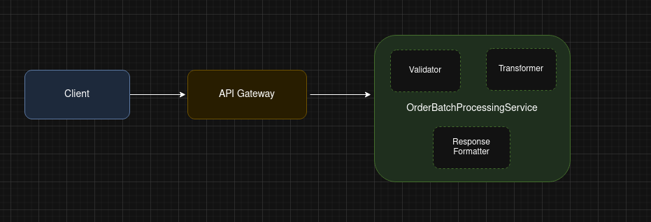

# Order Information Processing System - High Level Architecture

## Goals
- Accept batched order submissions via REST (single request with 1..N orders for 1..M customers)
- Validate order schema strictly (reject if unexpected/missing keys)
- Transform orders to two views:
  1. Per-customer flat list of purchased items
  2. Global customer summaries (item count, total amount in EUR)

## High level diagram

## Constraints / Assumptions
- Go in memory storage of order data per runtime instance is used purely to answer fetch requests
- No session handling or caching layer will be considered for this task
- Timestamp is passed through as string. We will not parse it and consider further for any schema validation
- Invalid orders are ignored (could alternatively reject whole batch but we choose to skip invalid and just log errors)
- Schema validation will be considered strictly based upon the key name and associated data type
- Pagination has not been considered while drafting this solution for the sake of simlicity
- Currency handling is limited to whole euros for the sake of simplicity

## Components

### 1. HTTP Layer
- Endpoints:
  - POST /orders/info - accept batch of orders in the provided format. Returns 200OK with customer items and validation errors for erroneous orders if found.

### 2. Validation & Parsing
- Strict JSON decoder to ensure no unexpected keys.

### 3. Transformation
- **Input**: `[]Order` - batch of customer orders
- **Processing**: 
  - Validates each order using `ValidateOrder` function
  - Transforms valid orders into flattened customer items
  - Aggregates data per customer for summary generation
- **Output**:
  - `[]CustomerItem` - flat list of all purchased items with customer ID
  - `[]CustomerSummary` - aggregated per-customer data
  - `[]ValidationError` - detailed errors for invalid orders

### 4. Error Handling Strategy
- Collect per-order validation error.

A detailed Order Management Subsystem following a DDD (Domain-Driven Design) approach is documented [here](./resources/docs/DDD.md). Please read it at your own leisure or ignore.
