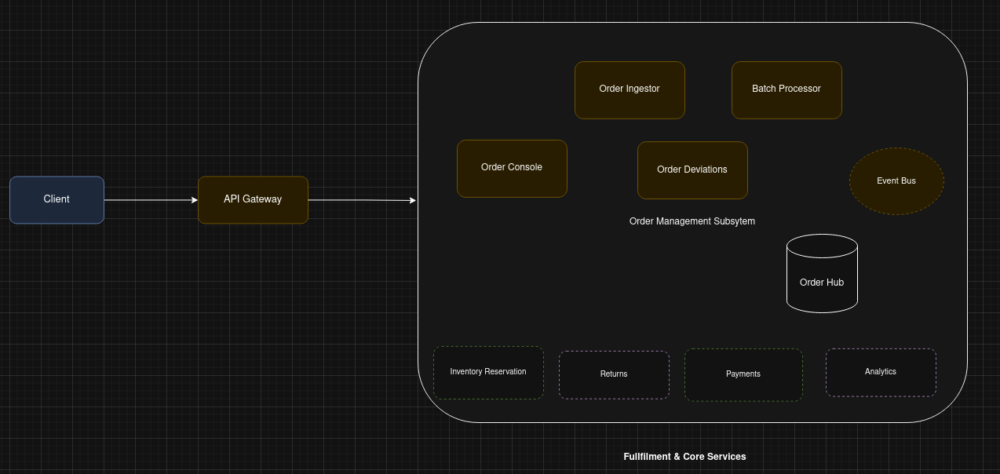

# E-Commerce Order System Architecture - Domain Driven Design

## System Overview

The e-commerce platform is architected as a distributed microservices system to 
handle high scalability demands of a popular retailer. The system follows 
domain-driven design principles, with services organized around business 
capabilities rather than technical functions.

## Order Management Subsystem (OMS)

The Order Management Subsystem (OMS) coordinates the full lifecycle of an 
order: capture, validation, deviation handling, orchestration of downstream 
actions such as inventory management and publication of state changes.

### What OMS Is

An internal domain-focused subsystem encapsulating order lifecycle logic and 
ensuring that external services interact through stable APIs/events rather than 
internal implementation details. It decouples ingestion speed, validation 
complexity, and downstream side-effects. This further enables systems to keep 
independence when it comes to deployment velocity and shorter time to market

### OMS Components In General(as depicted in the broader architecture diagram)
| Component | Purpose (Concise) |
|-----------|-------------------|
| Order Ingestor | Accepts incoming order submissions, performs lightweight structural checks, (future) idempotency, and forwards batches/events inward.
| Batch Processor (This Assignment) | Performs strict validation and transforms raw orders into per-customer item lists. 
| Order Deviations | Tracks and manages exceptions (validation failures, partial acceptances, business rule conflicts) for operator review. 
| Order Console | Operational UI/API surface for querying order status, deviations, or reprocessing actions. 
| Order Hub | Central store for canonical order records and their state transitions.
| Event Bus | Asynchronous backbone for publishing order lifecycle events (e.g., OrderCaptured, OrderValidated) consumed by inventory, payment, analytics. 
| Inventory Reservation (Downstream) | Reserves stock in response to validated orders/events. 
| Returns (Downstream) | Manages reverse inventory & logistics and adjustments
| Analytics (Downstream) | Builds dashboards and historical aggregates 

## High level diagram

### Current Assignment Focus
For this exercise, only the **Batch Processor** responsibilities are implemented: 
validate → transform → respond. All other OMS components are conceptual 
placeholders purely for explanatory purpose of how DDD fits in.

> Summary: The broader OMS diagram is illustrative. The implemented code in this 
repository covers only the Batch Processor slice of that future-ready architecture.

## Core domain/business service

### Order Service
**Responsibility:** Manages order lifecycle (validation, creation, processing, 
status tracking)
- **Current Implementation Focus:** The transformation module we are building 
represents a core component of this service, handling order validation and 
data transformation.
- Exposes REST APIs for various order related operations. For instance, order submission, retrieval, and batch processing
- Maintains order state transitions (placed → fulfilled → shipped -> last mile)

## Where Our Module Fits In

The order transformation module we are implementing sits within the **Order Service/ Order Info** as a critical component for:

1. **Request Processing:** It handles the initial parsing and validation of batch order submissions, ensuring data integrity before any business logic executes.

2. **Data Transformation:** It converts order data into two customer-centric views:
   - Individual item purchases (for customer history)
   - Customer purchase summaries (for analytics and dashboards)

## Communication Patterns

1. **Synchronous (REST/HTTP):**
   - Client → API Gateway → Order Service (our module) → immediate response
   - Used for user-facing operations requiring immediate confirmation
   - Our implementation follows this pattern with its REST API

2. **Asynchronous (Event-Driven):**
   - Order Service → Event Bus → (Inventory, Payment, Notification, Analytics)
   - Used for background processing and service decoupling
   - Our module would publish events upon successful order validation

For this task, we'll consider a synchronous based communication pattern

## Deployment Architecture

1. **Containerization:**
   - Each microservice deployed as a Docker container

2. **Orchestration:**
   - Serverless cloud offering for container orchestration
   - Auto-scaling based on load tests
   - Health checks

3. **Multi-region Deployment:**
   - Geographic distribution for lower latency
   - Data replication across regions
   - Region failover capabilities

## Evolution of Our Current Implementation

Our current implementation represents the **Order Service's transformation component**. 
In the full blown microservices architecture under the domain of Fulfillment Services:

1. It would accept orders via the API Gateway
2. Ingestion service will take the data and perform basic validation before passing 
   it on to batch processor for performing deep business validations.
2. After validation and transformation:
   - Persist order data in a relational/non-relational storage
   - Publish "OrderValidated" events to the Event Bus for any interested domain consumer
   - Return transformed data for immediate client response
